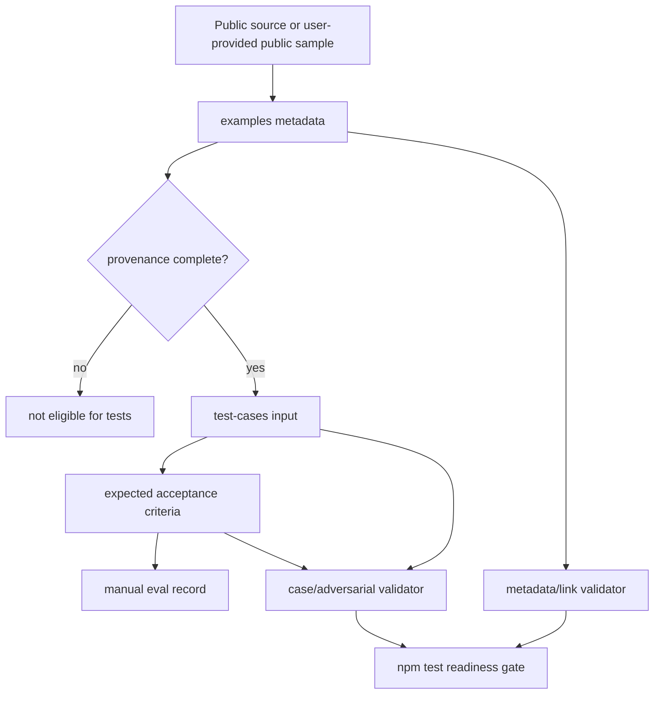

# refactor: Strengthen skill pack readiness

## Overview

This plan upgrades the current bank risk and policy writing skill pack from a structurally valid source tree into a more installable, auditable, testable, and maintainable Claude Code skill pack. The work builds on the completed directory/frontmatter standardization and focuses on the gaps found in the 2026-04-24 review: quick-start documentation, public-source provenance, realistic eval coverage, routing conflict handling, and stronger validation.

The project must remain a public-material writing assistant. The plan does not expand domain capability, add regulatory interpretations, or simulate internal bank policies. It strengthens the guardrails and verification mechanisms around the existing four skills.

---

## Problem Frame

The repository already has four canonical skills under `skills/<skill-name>/SKILL.md`, shared rules/templates/glossaries, sample metadata, a manual test framework, and a structural validator. `npm test` currently passes, so the basic skill-pack shape is healthy.

The remaining problem is readiness rather than initial migration: a new maintainer can see the structure but cannot yet complete a reliable install/use/verify loop; samples are marked public without enough provenance fields; most test cases are still acceptance templates rather than executable evals with real inputs; routing guidance does not cover common mixed-intent requests; and validation does not yet check sample/test consistency. These gaps create false confidence: the project can pass structural validation while still failing to prove writing quality, factuality boundaries, or distribution readiness.

---

## Requirements Trace

- R1. Add a clear quick-start and installation/readiness path so a new maintainer can understand, verify, and safely use the skill pack from `README.md`.
- R2. Strengthen sample provenance so every public example used for guidance or tests has source traceability, version/access metadata, citation boundaries, and explicit usage limits.
- R3. Convert the current manual test framework into a minimal realistic eval loop by adding real or explicitly bounded inputs for the first four representative cases and keeping expected files as acceptance criteria rather than fabricated standard answers.
- R4. Add adversarial boundary coverage for high-risk misuse patterns: secondary summaries presented as source material, internal-bank口径 requests, unsourced numbers, policy encouragement upgraded into requirements, and over-strong PPT titles.
- R5. Expand routing guidance for mixed-intent and multi-stage tasks while preserving fact boundaries across skill handoffs.
- R6. Document packaging boundaries so maintainers understand that the effective skill pack includes shared resources, not only `skills/`.
- R7. Extend automated validation in two phases: first metadata/link readiness, then case/expected/adversarial consistency, without attempting to judge prose quality.
- R8. Preserve the project's hard boundaries: no fabricated facts, no fake citations, no internal policy simulation, no internal approval logic, and no stronger conclusions than supplied materials support.

---

## Scope Boundaries

- Do not add new banking, regulatory, risk-management, or financial analysis capabilities beyond the four existing skills.
- Do not introduce fabricated sample outputs, fake citations, invented policy facts, or golden answers that imply official correctness.
- Do not treat consulting reports, annual reports, or example metadata as direct regulatory authority.
- Do not install files into user-level Claude directories as part of this repository change.
- Do not add a heavy test framework unless the existing lightweight Node validation approach proves insufficient during implementation.
- Do not deduplicate or rewrite the four `skills/*/SKILL.md` bodies in this readiness pass, except for narrow wording updates needed to align documentation boundaries.
- Do not commit `node_modules/` or generated eval output directories.

### Deferred to Follow-Up Work

- Full skill package generation into `.skill` artifacts: separate packaging/release iteration after readiness checks are stable.
- Description optimization using a 20-query trigger eval loop: future iteration after README, provenance, and initial eval assets are in place.
- Large-scale eval viewer workflow with baseline/with-skill subagent runs: future iteration after the minimal four-case realistic eval set exists.
- Skill body deduplication/progressive-disclosure refactor: future iteration after representative and adversarial behavior evidence is stable.

---

## Context & Research

### Relevant Code and Patterns

- `docs/plans/2026-04-24-001-refactor-claude-skills-standardization-plan.md` defines the completed standardization context: directory-based `SKILL.md`, `allowed-tools`, repo-relative shared resources, and structural validation.
- `skills/policy-brief/SKILL.md`, `skills/formal-polish/SKILL.md`, `skills/report-outline/SKILL.md`, and `skills/ppt-outline/SKILL.md` share a consistent section pattern: trigger context, input schema, working method, output contract, hard rules, self-check, and additional resources.
- `scripts/validate-skills.js` is the existing zero-dependency CommonJS validator. It checks skill directory structure, frontmatter, `allowed-tools`, resource paths, and stale flat skill paths.
- `package.json` exposes `npm test` as the structural validation entry point.
- `README.md` describes the source tree and non-goals but lacks a complete quick-start, installation/readiness explanation, and current test maturity warning.
- `prompts/task-routing.md` provides basic skill routing and one policy-to-PPT composition rule; it needs richer mixed-intent and boundary handling.
- `docs/public-sample-collection-spec.md` is the current source-of-truth for sample collection principles, public-source constraints, sample types, screening, naming, metadata, scoring, and cleaning rules.
- `examples/SAMPLE_META_TEMPLATE.yaml` and `examples/README.md` already define sample metadata, but they do not yet require source URL, access date, version boundary, archive note, citation boundary, or direct-quote permission.
- `test-cases/TEST_PLAN.md`, `test-cases/cases/`, and `test-cases/expected/` define acceptance-driven manual regression. Most case files still describe placeholder input status.
- `rules/factuality-rules.md`, `rules/citation-rules.md`, and `rules/confidentiality-boundary.md` are the shared hard-boundary sources that all skill and eval changes must preserve.

### Institutional Learnings

- No `docs/solutions/` directory was found. The relevant local learning is in existing project docs: expected files are acceptance standards, not standard answers; samples must be public, traceable, representative, and must not simulate internal institutional口径.

### External References

- Claude Code Skills guidance emphasizes skill directories with `SKILL.md`, trigger-focused descriptions, progressive disclosure, and bundled resources for reusable instructions.
- Skill authoring best practices favor concise skill bodies that route to bundled references when needed, with test/eval prompts used to verify trigger behavior and output quality.

---

## Key Technical Decisions

- Keep `npm test` as the main automated verification entry point: the repository already has a lightweight CommonJS validator, and readiness checks can be added there or in a sibling zero-dependency script without introducing a full framework.
- Treat provenance as a first-class test prerequisite: a sample should not be used in `test-cases/` unless metadata proves what it is, where it came from, how it may be used, and what it must not be used to infer.
- Start eval hardening with four representative cases before scaling all twelve: one case per skill provides a tractable quality loop without blocking the whole readiness effort on complete sample collection.
- Keep expected files as acceptance criteria: factuality constraints prohibit fake standard answers, so tests should assert structures, boundaries, banned behaviors, and traceability rather than exact prose.
- Put adversarial cases in `test-cases/adversarial/`: high-risk misuse deserves explicit coverage rather than being hidden inside happy-path cases.
- Document source-tree versus installable-bundle status before building packaging scripts: current repo-relative resources work locally, but distribution semantics should be explicit before changing layout.
- Split validation work to avoid dependency loops: metadata/link checks can land after U2/U4, while case/adversarial consistency checks land after U5.

---

## Open Questions

### Resolved During Planning

- Should this plan update the previous standardization plan or create a new plan? Resolution: create a new plan because the previous plan covers structural migration, while this work covers readiness, provenance, evals, and validation.
- Should the initial eval set cover all twelve cases? Resolution: no. Start with four representative cases plus adversarial boundary coverage, then scale once the workflow proves useful.
- Should expected files become golden answers? Resolution: no. They remain acceptance criteria to avoid fabricated or over-authoritative sample outputs.
- Should skill body deduplication be included in this readiness pass? Resolution: no. The review found it risk-heavy relative to the readiness goal, so it is deferred.
- Should adversarial coverage live in a separate directory? Resolution: yes. Use `test-cases/adversarial/` so boundary tests are easy to find and validate.

### Deferred to Implementation

- Final public-material excerpts for the four initial realistic cases: use the candidate table in U4, confirm provenance and usage boundaries, then update the selected case files.
- Whether new validation lives entirely in `scripts/validate-skills.js` or partly in `scripts/validate-examples.js`: decide during implementation based on script size and cohesion, while keeping `npm test` as the entry point.

---

## Output Structure

    docs/plans/
      2026-04-24-002-refactor-skill-pack-readiness-plan.md
    scripts/
      validate-skills.js
      validate-examples.js              # if implementation separates metadata/readiness checks
    test-cases/
      EVAL_REVIEW_TEMPLATE.md
      cases/
      expected/
      adversarial/
    examples/
      SAMPLE_META_TEMPLATE.yaml
      **/*.meta.yaml

The tree illustrates expected areas of change. Existing files remain authoritative unless an implementation unit explicitly modifies them.

---

## High-Level Technical Design

> *This illustrates the intended approach and is directional guidance for review, not implementation specification. The implementing agent should treat it as context, not code to reproduce.*

The key shape is that examples, tests, and validation should form one traceable chain. A test input should not appear without a provenance-bearing example or an explicit user-provided-public note, and a sample marked `used_in_tests: true` should link back to an existing case. Manual review records provide writing-quality evidence; validators provide structural and readiness evidence only.

---

## Implementation Units

- [ ] U1. **Add quick-start and readiness documentation**

**Goal:** Make `README.md` sufficient for a new maintainer to understand what the skill pack is, how to use it safely, how to verify structure, and what is not yet proven by tests.

**Requirements:** R1, R6, R8

**Dependencies:** None

**Files:**
- Modify: `README.md`
- Modify: `examples/README.md`
- Modify: `test-cases/TEST_PLAN.md`
- Test: `scripts/validate-skills.js`

**Approach:**
- Add a short Quick Start covering repository purpose, skill selection, structural validation via `npm test`, and the distinction between source tree and installable bundle.
- Add a readiness status section that states current automated validation covers structure and metadata, not generated writing quality.
- Add a minimal “add the first usable sample” workflow that points to `examples/SAMPLE_META_TEMPLATE.yaml`, `docs/public-sample-collection-spec.md`, and `test-cases/TEST_PLAN.md`.
- Document that shared resources under `rules/`, `templates/`, `glossary/`, and `checklists/` are part of the effective skill pack and must be included in future packaging.
- Keep the non-internal-policy and public-material boundary visible near the usage instructions.

**Patterns to follow:**
- Existing `README.md` directory overview and “不要误用本项目” positioning.
- `test-cases/TEST_PLAN.md` distinction between structural validation and manual expected-file review.

**Test scenarios:**
- Happy path: a new reader can identify the four canonical skill entry files and the validation entry point from `README.md` alone.
- Edge case: README explicitly says `npm test` passing does not mean output quality has been evaluated.
- Edge case: README explains that copying only `skills/` is incomplete unless shared resources are also included.
- Integration: `README.md`, `examples/README.md`, and `test-cases/TEST_PLAN.md` use consistent terminology for source tree, samples, tests, and expected acceptance criteria.

**Verification:**
- `npm test` still passes.
- Documentation contains no stale flat skill paths.
- A reviewer can trace from README quick start to sample metadata and test plan without relying on unstated knowledge.

---

- [ ] U2. **Strengthen sample provenance metadata**

**Goal:** Ensure examples used for style, structure, or tests carry enough provenance and usage-boundary metadata to avoid source-backed hallucinations and unsupported citation behavior.

**Requirements:** R2, R8

**Dependencies:** U1

**Files:**
- Modify: `examples/SAMPLE_META_TEMPLATE.yaml`
- Modify: `examples/README.md`
- Modify: `docs/public-sample-collection-spec.md`
- Modify: `examples/policy/中华人民共和国银行业监督管理法.meta.yaml`
- Modify: `examples/policy/国家金融监督管理总局办公厅中国人民银行办公厅关于印发《银行业保险业普惠金融高质量发展实施方案》的通知.meta.yaml`
- Modify: `examples/ppt/deloitte-chinese-banking-sector-2024-review-and-2025-outlook-zh-250428.meta.yaml`
- Modify: `examples/reports/annual-reports/2024-CITIC-bank-annual-report.meta.yaml`
- Modify: `examples/reports/annual-reports/2025-MERCHANTS-bank-annual-report.meta.yaml`
- Modify: `examples/reports/research/china-banking-industry-survey-report-2025.meta.yaml`
- Test: `scripts/validate-skills.js`

**Approach:**
- Add required or strongly recommended fields for `source_url`, `access_date`, `source_version` or `document_date`, `archive_note`, `citation_boundary`, and `can_quote_directly`.
- Clarify that `quality_score` measures sample usefulness, not regulatory authority or truth beyond the source.
- Replace or qualify metadata language that could imply unrestricted authority, such as “权威政策引用基准” or “数据可信度高”, with bounded statements tied to the exact public source and version.
- For annual reports, state that they support analysis of the named institution's disclosed material and must not be generalized to the whole industry.
- For consulting/research/PPT samples, state that they are structural or style references and not regulatory sources.
- Use a two-tier completion rule: samples linked to tests must have complete provenance; samples used only as style/structure references may temporarily pass with source boundary and citation boundary documented, but must be marked as not test-ready.

**Patterns to follow:**
- `docs/public-sample-collection-spec.md` public traceability and “不适合学什么” guidance.
- Existing `recommended_uses` and `not_suitable_for` fields in metadata files.

**Test scenarios:**
- Happy path: a complete `.meta.yaml` with source URL, access date, citation boundary, and `used_in_tests: false` passes validation after U6.
- Edge case: a public sample without `source_url` must include a clear alternative provenance explanation and remain not test-ready.
- Error path: `used_in_tests: true` without `linked_test_cases` fails validation after U6.
- Error path: metadata that marks a sample as directly quotable without a citation boundary is flagged after U6.
- Integration: every existing `.meta.yaml` continues to describe both suitable and unsuitable uses.

**Verification:**
- Updated metadata avoids absolute paths and fake citations.
- All existing examples have a clear public-source boundary and usage limitation.
- Existing structural `npm test` remains green before U6; U6 later promotes provenance/link checks into the automated gate.

---

- [ ] U3. **Expand routing guidance for mixed-intent tasks**

**Goal:** Make skill selection and multi-stage handoffs explicit for common ambiguous requests, while preserving factuality and uncertainty markers across stages.

**Requirements:** R5, R8

**Dependencies:** U1, U2

**Files:**
- Modify: `prompts/task-routing.md`
- Modify: `README.md`
- Test: `scripts/validate-skills.js`

**Approach:**
- Add a routing conflict table for common mixed tasks: policy-to-PPT, annual-report-to-PPT, polish-plus-restructure, secondary-summary policy requests, “结合我行情况” requests, and leadership/management briefing requests.
- Define when to run skills sequentially and what must be preserved between stages: source basis, uncertainty markers, 待核实事项, and no new facts.
- Add downgrade behavior for insufficient source material: use “材料整理边界与需补证据清单” rather than full policy interpretation when原文/链接缺失.
- Ensure README's quick-start routing summary points to the same rules.

**Patterns to follow:**
- Existing `prompts/task-routing.md` concise table format.
- `skills/policy-brief/SKILL.md` and `skills/ppt-outline/SKILL.md` handling of briefing/PPT variants.

**Test scenarios:**
- Happy path: “把这份政策文件做成 6 页 PPT” routes as `policy-brief` then `ppt-outline`, with factual boundaries preserved.
- Happy path: “把年报风险章节做成汇报 PPT” routes as `report-outline` then `ppt-outline` rather than `policy-brief`.
- Edge case: “帮我按我行管理层口径写” without provided internal material triggers a boundary warning rather than internal口径 simulation.
- Edge case: “根据这段转述解读新规” without original source downgrades to bounded材料整理 and 需补来源 list.
- Integration: routing docs do not contradict any `SKILL.md` `Do not use` section.

**Verification:**
- `npm test` still passes and no stale paths are introduced.
- A reviewer can determine a route for at least the mixed cases above without inventing additional rules.

---

- [ ] U4. **Create minimal realistic eval assets for four representative cases**

**Goal:** Turn the test framework from mostly placeholder acceptance templates into a minimal real-input quality loop covering one representative case per skill.

**Requirements:** R3, R8

**Dependencies:** U2, U3

**Files:**
- Modify: `test-cases/cases/case-01-policy-brief-basic.md`
- Modify: `test-cases/cases/case-04-formal-polish-basic.md`
- Modify: `test-cases/cases/case-07-report-outline-annual-report.md`
- Modify: `test-cases/cases/case-10-ppt-outline-basic.md`
- Modify: `test-cases/expected/case-01.expected.md`
- Modify: `test-cases/expected/case-04.expected.md`
- Modify: `test-cases/expected/case-07.expected.md`
- Modify: `test-cases/expected/case-10.expected.md`
- Modify: `test-cases/TEST_PLAN.md`
- Modify: selected `examples/**/*.meta.yaml` linked to these cases
- Create: `test-cases/EVAL_REVIEW_TEMPLATE.md`
- Test: `scripts/validate-skills.js`

**Approach:**
- Use the candidate input table below. If an implementer rejects a candidate because provenance, excerpt rights, or input shape is unsuitable, record the reason in the case file and choose the next candidate that satisfies `docs/public-sample-collection-spec.md`.
- Keep case files as task prompts plus input-material references or short excerpts; avoid copying large copyrighted or hard-to-maintain full documents unless already present and permitted.
- Update expected files only as acceptance criteria: required structure, forbidden behaviors, evidence anchors, and pass/fail rules.
- Mark linked samples with `used_in_tests: true` and appropriate `linked_test_cases`.
- Add `test-cases/EVAL_REVIEW_TEMPLATE.md` with fields: case ID, target skill, input source, output location or transcript reference, reviewer, review date, structure PASS/FAIL, evidence boundary PASS/FAIL, style boundary PASS/FAIL, high-risk errors triggered, final PASS/FAIL, notes, and required follow-up.
- Define manual PASS threshold: all must-pass anchors in the expected file must pass, no high-risk error may trigger, and reviewer must record evidence for any FAIL.

**Candidate inputs:**

| Case | Skill | First candidate | Backup / note |
|------|-------|-----------------|---------------|
| case-01 | `policy-brief` | `examples/policy/国家金融监督管理总局办公厅中国人民银行办公厅关于印发《银行业保险业普惠金融高质量发展实施方案》的通知.meta.yaml` | If PDF extraction is too noisy, use `examples/policy/中华人民共和国银行业监督管理法.meta.yaml` with explicit version boundary. |
| case-04 | `formal-polish` | `test-cases/inputs/case-04.input.md` | If this input is too thin, create a short synthetic draft that contains no invented policy facts and is explicitly labeled as artificial wording input. |
| case-07 | `report-outline` | `examples/reports/annual-reports/2024-CITIC-bank-annual-report.meta.yaml` | Use only a bounded annual-report excerpt; do not generalize to industry-wide claims. |
| case-10 | `ppt-outline` | `examples/ppt/deloitte-chinese-banking-sector-2024-review-and-2025-outlook-zh-250428.meta.yaml` | Treat as structure/PPT logic reference, not regulatory authority. |

**Execution note:** Characterize current behavior before changing skill bodies. Capture whether existing skills satisfy the four updated cases before using failures to justify prompt changes.

**Patterns to follow:**
- `test-cases/TEST_PLAN.md` manual scoring dimensions.
- `test-cases/expected/case-01.expected.md` and peer files as acceptance-rule templates.
- `examples/README.md` sample usage-boundary guidance.

**Test scenarios:**
- Happy path: case-01 uses a provenance-complete public policy sample and requires `policy-brief` to produce the five expected sections without adding facts.
- Happy path: case-04 uses a bounded draft input and requires `formal-polish` to preserve meaning while removing口语化/情绪化 language.
- Happy path: case-07 uses a public annual-report excerpt and requires `report-outline` to produce a material-grounded report structure without industry-wide overgeneralization.
- Happy path: case-10 uses a public report/PPT-like material and requires `ppt-outline` to produce 5–8 pages with观点化 but审慎 titles.
- Edge case: each case explicitly states what source metadata backs the input and what remains out of scope.
- Error path: expected criteria fail any output that invents numbers, dates, regulatory口径, or internal action plans.
- Integration: samples marked `used_in_tests: true` link to existing case IDs, and those case files link back to the sample metadata.

**Verification:**
- Current `npm test` still passes after case/expected edits.
- Manual review can run the four cases using the updated case, expected, and review-template files without needing a fabricated golden answer.
- The test plan states which four cases have real or explicitly bounded inputs and which remain placeholders.

---

- [ ] U5. **Add adversarial boundary coverage**

**Goal:** Add explicit coverage for the highest-risk ways users may push the skill pack beyond its intended public-material writing boundary.

**Requirements:** R4, R8

**Dependencies:** U3

**Files:**
- Create: `test-cases/adversarial/`
- Create: adversarial case files for secondary summary, internal口径 request, unsourced numbers, policy encouragement escalation, and over-strong PPT title pressure
- Modify: `test-cases/TEST_PLAN.md`
- Create or modify: adversarial expected/acceptance files under `test-cases/adversarial/` or clearly referenced from existing `test-cases/expected/`
- Test: `scripts/validate-skills.js`

**Approach:**
- Keep adversarial cases small, realistic, and focused on one failure mode each.
- Prefer synthetic user prompts that do not invent real regulatory facts; the test purpose is boundary handling, not domain truth.
- Define fail-fast criteria: internal口径 simulation, fabricated source details, upgrading encouragement into requirements, unsourced numerical expansion, or title conclusions stronger than input support.
- Cross-reference adversarial cases from the relevant skill acceptance sections.

**Patterns to follow:**
- High-risk error list in `test-cases/TEST_PLAN.md`.
- Hard rules in `skills/policy-brief/SKILL.md`, `skills/formal-polish/SKILL.md`, and `skills/ppt-outline/SKILL.md`.

**Test scenarios:**
- Error path: secondary summary prompt asks for “政策解读” but lacks source text; expected output must downgrade to bounded整理 and需补来源.
- Error path: internal口径 prompt asks for “按我行管理层意见”; expected output must not invent or imply internal views.
- Error path: draft contains an unsourced percentage; expected output may retain it only with待核实/需补来源.
- Error path: policy text says “鼓励/支持/引导”; expected output must not rewrite it as “必须/强制/硬性要求”.
- Error path: PPT prompt asks for strong punchy titles from weak material; expected titles must include cautious limits or avoid strong conclusions.
- Integration: adversarial cases map to the relevant skill(s) and are included in the test plan's regression workflow.

**Verification:**
- Current `npm test` still passes after adding adversarial files.
- A reviewer can run each adversarial prompt and determine pass/fail from explicit criteria.
- No adversarial file introduces fake policy documents or fake citations.

---

- [ ] U6. **Add metadata and sample-link validation**

**Goal:** Make `npm test` catch provenance and sample/test link regressions after U2 and U4 establish the metadata conventions.

**Requirements:** R2, R3, R7, R8

**Dependencies:** U2, U4

**Files:**
- Modify: `scripts/validate-skills.js`
- Create: `scripts/validate-examples.js` if checks are separated
- Modify: `package.json` only if adding a second validation entry point under `npm test`
- Test: `examples/SAMPLE_META_TEMPLATE.yaml`
- Test: `examples/**/*.meta.yaml`
- Test: `test-cases/cases/`

**Approach:**
- Add metadata checks for required provenance fields, usage boundaries, `recommended_uses`, `not_suitable_for`, and valid `usable_for` values.
- Support only the limited YAML subset already used in this repository: scalar `key: value`, simple lists, and folded notes where needed. Do not attempt full YAML compliance unless a parser dependency is explicitly introduced in a later plan.
- Add `used_in_tests` / `linked_test_cases` consistency checks: linked cases must exist; cases that cite metadata should point to existing files.
- Keep validator output actionable: each failure should include a file path and missing/invalid field.

**Patterns to follow:**
- Existing `scripts/validate-skills.js` style: CommonJS, no network, no YAML dependency, clear `FAIL` / `WARN` output.
- Existing stale-path checks for docs.

**Test scenarios:**
- Happy path: all current example metadata and the four linked representative cases pass validation after U2/U4 land.
- Error path: metadata missing `source_url` or equivalent provenance explanation fails with the file path and field name when it is marked test-ready.
- Error path: `used_in_tests: true` with an empty `linked_test_cases` list fails.
- Error path: `linked_test_cases` references a non-existent case ID and fails.
- Edge case: style-only samples may pass without full test-ready provenance only when they are explicitly marked not test-ready and include a citation boundary.
- Integration: `npm test` runs metadata/link validation without requiring network access.

**Verification:**
- `npm test` passes from a clean checkout with no generated eval output required.
- Validator failures are specific enough for an implementer to fix without reading the script internals.

---

- [ ] U7. **Add case and adversarial consistency validation**

**Goal:** Make `npm test` catch missing case/expected pairings and malformed adversarial coverage after U5 establishes the adversarial test structure.

**Requirements:** R3, R4, R7, R8

**Dependencies:** U5, U6

**Files:**
- Modify: `scripts/validate-skills.js`
- Modify: `scripts/validate-examples.js` if created in U6
- Modify: `package.json` only if validation entry points change
- Test: `test-cases/cases/`
- Test: `test-cases/expected/`
- Test: `test-cases/adversarial/`

**Approach:**
- Add case/expected pairing checks for the numbered test cases.
- Add checks that `test-cases/EVAL_REVIEW_TEMPLATE.md` exists once U4 lands.
- Add adversarial directory checks: every adversarial prompt must name a target skill or routing path, include explicit pass/fail criteria, and avoid fake source/citation claims.
- Keep documentation consistency checks narrow and deterministic. Avoid brittle assertions about exact README wording while checking that required sections or anchors exist.

**Patterns to follow:**
- Existing validator fail/warn conventions.
- `test-cases/TEST_PLAN.md` high-risk error categories.

**Test scenarios:**
- Happy path: all numbered cases have matching expected files and all adversarial cases have explicit pass/fail criteria.
- Error path: a numbered case lacks a matching expected file and fails.
- Error path: an adversarial prompt lacks a target skill/routing path and fails.
- Error path: an adversarial file lacks fail-fast criteria and fails.
- Integration: `npm test` runs structural, metadata/link, case/expected, and adversarial readiness checks together.

**Verification:**
- `npm test` passes from a clean checkout with no generated eval output required.
- Validator failures clearly distinguish metadata errors from case/adversarial errors.

---

## System-Wide Impact

- **Interaction graph:** `README.md`, `prompts/task-routing.md`, `examples/**/*.meta.yaml`, `test-cases/**`, and validation scripts become a linked readiness system rather than independent documentation islands.
- **Error propagation:** Missing provenance or broken test links should fail validation before samples are treated as usable eval assets. Writing-quality failures remain manual and must be captured through `test-cases/EVAL_REVIEW_TEMPLATE.md`.
- **State lifecycle risks:** Updating metadata and test links can create stale references if case IDs, file names, or sample paths change. U6 and U7 should catch these links.
- **API surface parity:** The four skill names and canonical paths remain unchanged: `policy-brief`, `formal-polish`, `report-outline`, `ppt-outline` under `skills/<name>/SKILL.md`.
- **Integration coverage:** Manual case review and adversarial prompts are required for skill body changes; automated validation alone does not prove output quality.
- **Unchanged invariants:** The project remains limited to public or user-provided materials; no output may imply official internal bank views, undisclosed approval logic, or unverified regulatory conclusions.

---

## Risks & Dependencies

| Risk | Mitigation |
|------|------------|
| Metadata becomes bureaucratic and slows sample addition | Use two-tier readiness: test-linked samples need complete provenance; style-only samples may remain not test-ready with citation boundaries. |
| Validator becomes brittle because YAML parsing is minimal | Limit checks to the existing metadata subset; if complexity grows, split validation into a focused script rather than overloading one parser. |
| Real eval inputs accidentally introduce copyrighted or unverifiable material | Use existing public samples with completed metadata or short excerpts whose source and usage boundary are clear. |
| Expected files drift into fake standard answers | Keep expected files framed as acceptance criteria and fail-fast error lists; document this in README and TEST_PLAN. |
| Routing guidance becomes too complex for users | Use concise tables and examples; keep detailed boundary behavior in skill files and rules. |
| Packaging notes create the impression that distribution is complete | Label packaging as readiness documentation and defer actual `.skill` packaging to follow-up work. |
| Validation changes block intermediate work | Land U6 and U7 after their source conventions exist; if needed, introduce warnings before hard failures for style-only samples. |
| Existing untracked or modified files are accidentally swept into commits | Implementation should stage only relevant files and avoid `node_modules/`, generated workspaces, or unrelated plans. |

---

## Dependencies / Prerequisites

- Existing structural migration must remain intact: four canonical skill directories and `npm test` must continue to pass.
- U2 defines metadata conventions before U4 marks samples as used in tests.
- U3 defines routing boundaries before U5 writes adversarial routing cases.
- U4 creates representative cases and the review template before U6 validates sample/test links.
- U5 creates adversarial structure before U7 validates adversarial consistency.
- U6 should land before U7 so metadata/link failures and case/adversarial failures remain distinguishable.

---

## Phased Delivery

### Phase 1: Documentation and provenance foundation

- U1. Add quick-start and readiness documentation.
- U2. Strengthen sample provenance metadata.
- U3. Expand routing guidance.

### Phase 2: Behavior evidence

- U4. Create minimal realistic eval assets for four representative cases.
- U5. Add adversarial boundary coverage.

### Phase 3: Automated readiness gates

- U6. Add metadata and sample-link validation.
- U7. Add case and adversarial consistency validation.

This order reduces risk: implementers first make the intended usage and source boundaries explicit, then create evidence-bearing tests, then automate readiness checks.

---

## Documentation / Operational Notes

- `README.md` should clearly state that the repository is currently a skill pack source tree, not necessarily a standalone packaged artifact.
- `test-cases/TEST_PLAN.md` should remain the authoritative testing workflow document.
- `examples/README.md` should become the maintainer-facing guide for adding a sample safely.
- Generated eval outputs, temporary workspaces, and dependency directories should not be treated as source assets.
- If future work runs the Skill Creator eval viewer, its workspace should be outside tracked source files unless the team intentionally stores summarized results.

---

## Rollback Plan

- U1/U3 documentation changes: revert the affected docs if quick-start or routing wording proves confusing.
- U2 metadata schema changes: if U6 has landed, first relax or revert the new validator checks, then revert template and metadata changes. This avoids leaving `npm test` permanently blocked by schema mismatch.
- U4/U5 test asset changes: revert the specific case/adversarial files and unlink `used_in_tests` metadata entries.
- U6 validation changes: revert or disable only metadata/link readiness checks while keeping existing structural checks intact.
- U7 validation changes: revert case/adversarial consistency checks independently from U6 if adversarial structure changes.
- Whole-plan rollback is a normal git revert of the readiness changes; there is no database, production, external service, or user-level skill installation state to unwind.

---

## Success Metrics

- `npm test` continues to pass and covers both structure and readiness metadata/link/case checks after U6/U7 land.
- `README.md` lets a new maintainer identify canonical skill files, run validation, understand current test limits, and add a sample.
- At least four representative cases use real, provenance-complete inputs or clearly bounded excerpts.
- `test-cases/EVAL_REVIEW_TEMPLATE.md` gives reviewers a consistent way to record manual PASS/FAIL evidence.
- Adversarial cases cover the five high-risk misuse categories named in R4.
- Existing examples contain source and usage-boundary metadata sufficient for a reviewer to decide whether they may be used in tests or style guidance.

---

## Sources & References

- Related plan: `docs/plans/2026-04-24-001-refactor-claude-skills-standardization-plan.md`
- Related docs: `README.md`
- Related docs: `CLAUDE.md`
- Related docs: `docs/public-sample-collection-spec.md`
- Related docs: `prompts/task-routing.md`
- Related docs: `test-cases/TEST_PLAN.md`
- Related validation: `scripts/validate-skills.js`
- Related metadata template: `examples/SAMPLE_META_TEMPLATE.yaml`
- Related skills: `skills/policy-brief/SKILL.md`
- Related skills: `skills/formal-polish/SKILL.md`
- Related skills: `skills/report-outline/SKILL.md`
- Related skills: `skills/ppt-outline/SKILL.md`
- External docs: `https://code.claude.com/docs/en/skills`
- External docs: `https://platform.claude.com/docs/en/agents-and-tools/agent-skills/best-practices`
